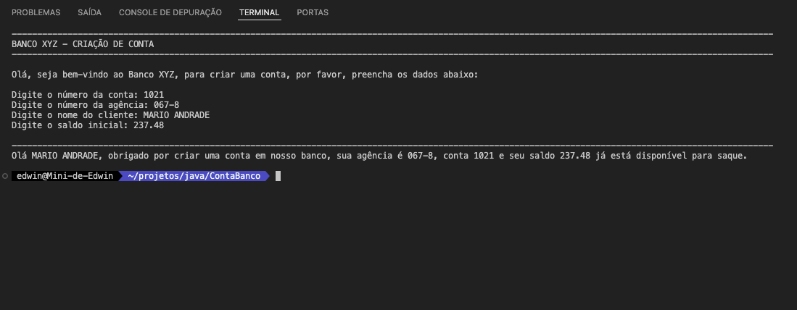

# Projeto ContaBanco
Este projeto consiste em uma aplicação simples que recebe dados via terminal para criar uma conta bancária.

## Screenshots

    
     
      

## Classe ContaTerminal.java
A classe `ContaTerminal.java` é responsável por toda a codificação do nosso programa. Ela solicita ao usuário que insira as seguintes informações:

## Entrada de dados
Os dados são inseridos via terminal. O programa solicita cada informação ao usuário, por exemplo:

- Número da conta (inteiro, por exemplo, 1021)
- Número da agência (texto, por exemplo, 067-8)
- Nome do cliente (texto, por exemplo, MARIO ANDRADE)
- Saldo inicial (decimal, por exemplo, 237.48)

## Saída de dados
Depois que todas as informações foram inseridas, o sistema exibe a seguinte mensagem:

Olá [CLIENTE], obrigado por criar uma conta em nosso banco, sua agência é [AGENCIA], conta [CONTA] e seu saldo [SALDO] já está disponível para saque.

## Revisões
Este projeto é uma boa oportunidade para revisar sobre:

- Regras de declaração de variáveis
- Terminal, main args e a classe Scanner
- Concatenação e a classe String com o método concat